# My Qtile Desktop

A workspace-aware Arch Linux desktop powered by Qtile, X11 and a coordinated
wallpaper-to-palette system.

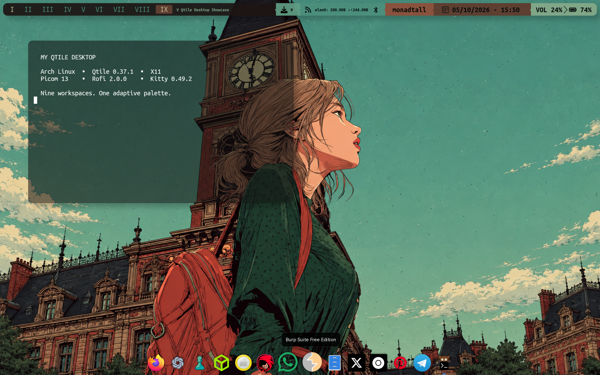

## Overview

This repository is a sanitized snapshot of a real Arch Linux session audited on
2026-10-05. Qtile manages nine X11 workspaces; Feh changes their wallpapers and
a Python hook recolours the Qtile bar and borders from stored per-workspace
palettes. Picom supplies blur, shadows, rounded corners and animations. Rofi,
Kitty and Plank complete the main interaction layer, while custom GTK
MacWidgets appear on empty workspaces.

## Screenshots

| Launcher | Terminal |
|---|---|
| 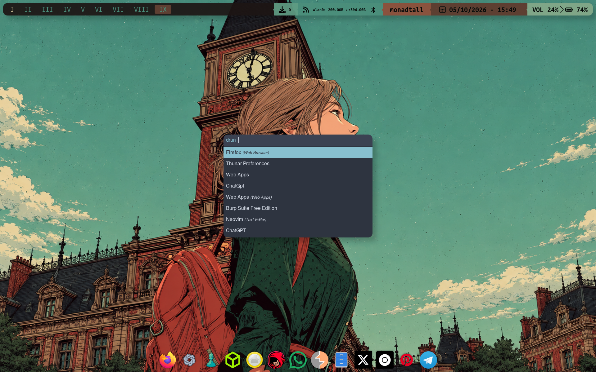 | 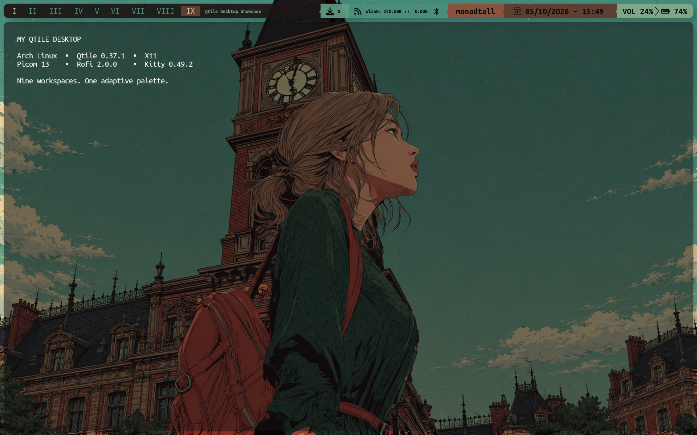 |

### Desktop widgets

MacWidgets uses translucent GTK cards and is automatically shown on empty
workspaces, then hidden by Qtile when an application window appears.

<p align="center">
  <a href="assets/screenshots/desktop/widgets.png">
    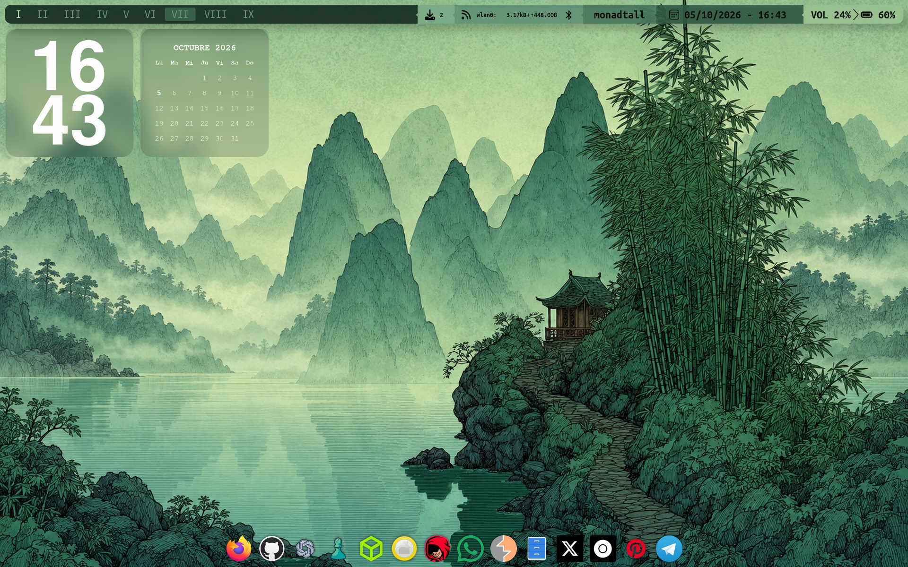
  </a>
</p>

<details>
<summary><strong>Terminal showcase — Htop, Ranger and Btop</strong></summary>
<br>

| Htop | Ranger |
|---|---|
| 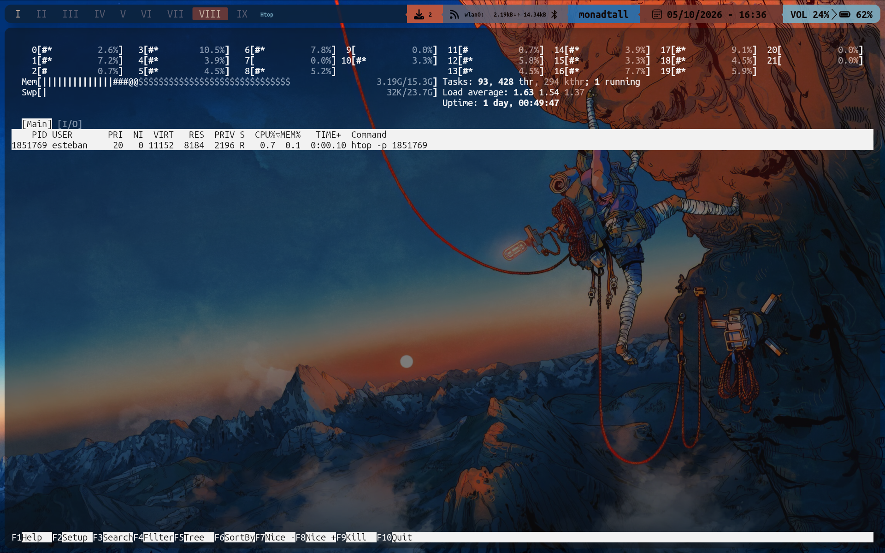 | 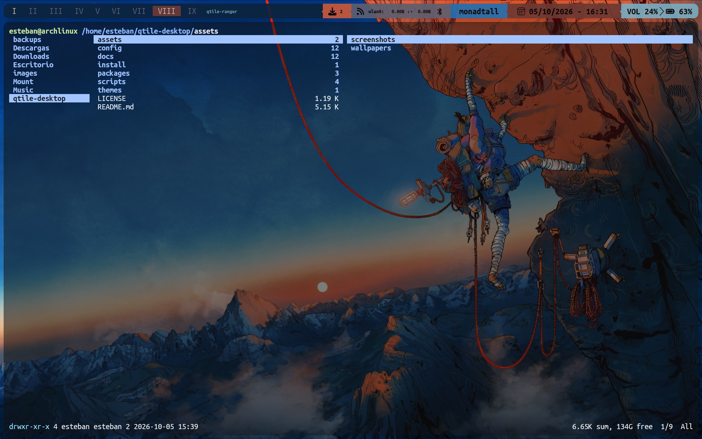 |

<p align="center">
  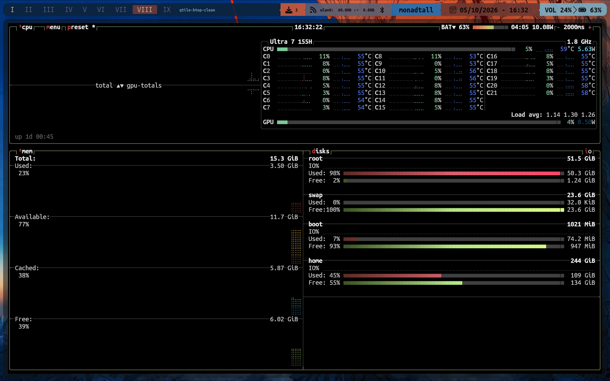
</p>

</details>

### Workspaces

The groups use identical layouts and controls; wallpaper and palette are the
intentional differences. The gallery stays collapsed by default so it does not
overwhelm the project page.

<details open>
<summary><strong>Open the complete nine-workspace gallery</strong></summary>
<br>

| I | II | III |
|---|---|---|
| <a href="assets/screenshots/workspaces/workspace-I.png">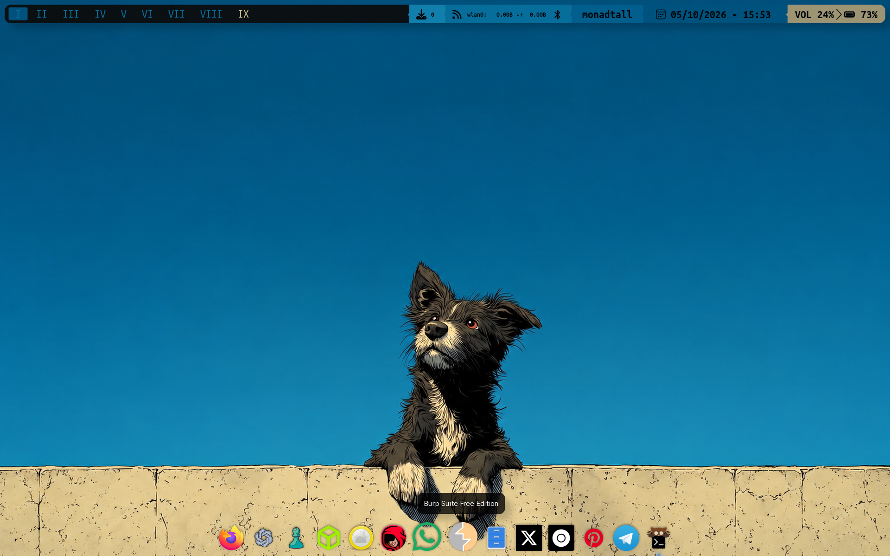</a> | <a href="assets/screenshots/workspaces/workspace-II.png">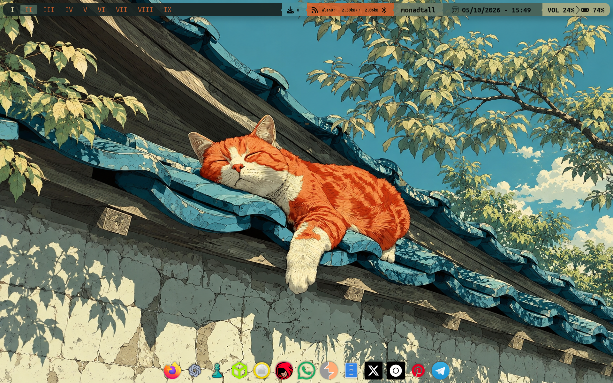</a> | <a href="assets/screenshots/workspaces/workspace-III.png">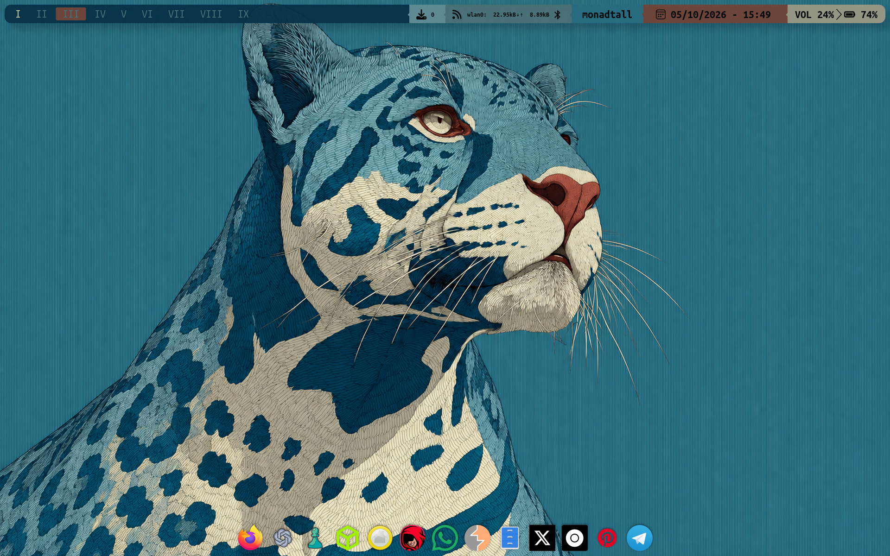</a> |
| **IV** | **V** | **VI** |
| <a href="assets/screenshots/workspaces/workspace-IV.png">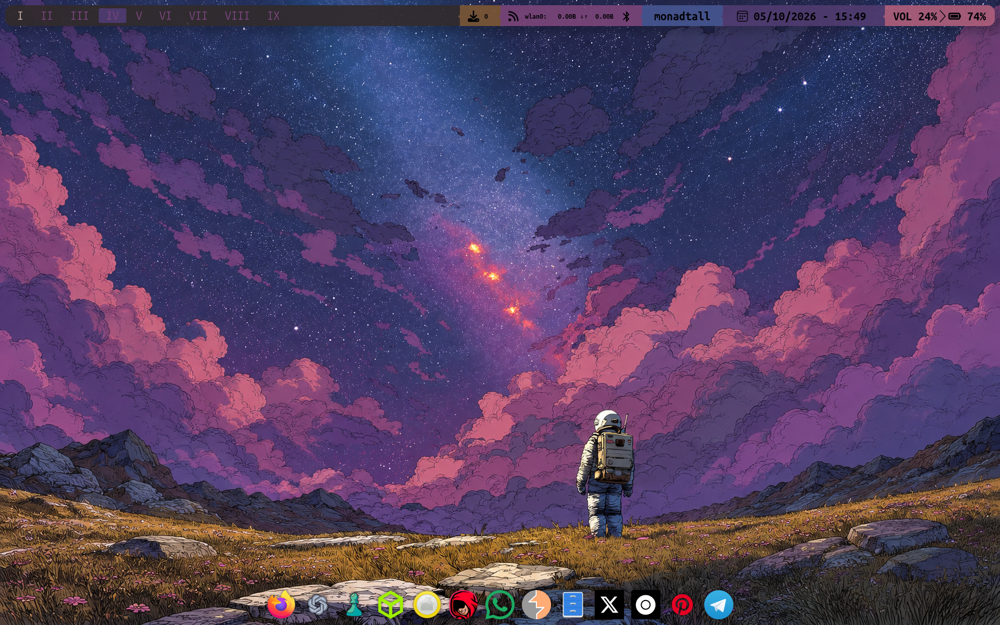</a> | <a href="assets/screenshots/workspaces/workspace-V.png">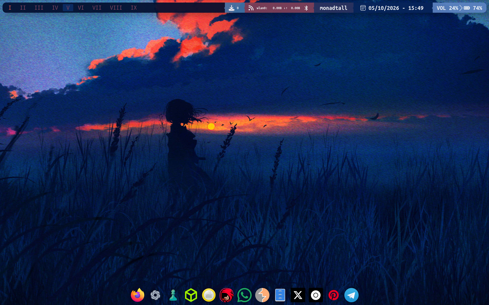</a> | <a href="assets/screenshots/workspaces/workspace-VI.png">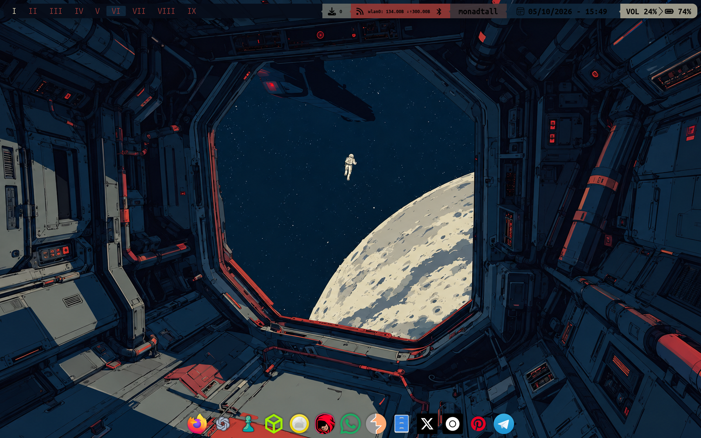</a> |
| **VII** | **VIII** | **IX** |
| <a href="assets/screenshots/workspaces/workspace-VII.png">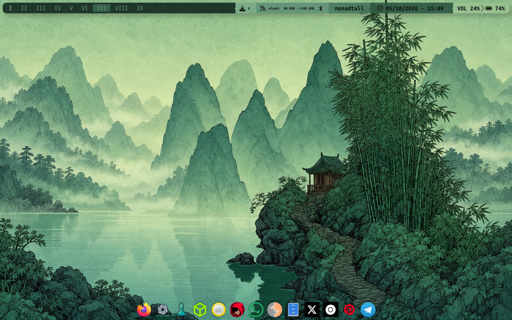</a> | <a href="assets/screenshots/workspaces/workspace-VIII.png">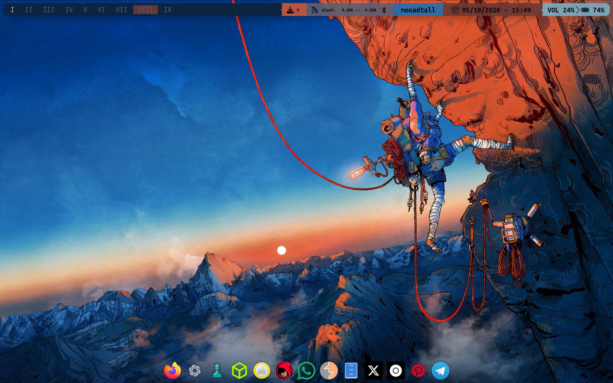</a> | <a href="assets/screenshots/workspaces/workspace-IX.png">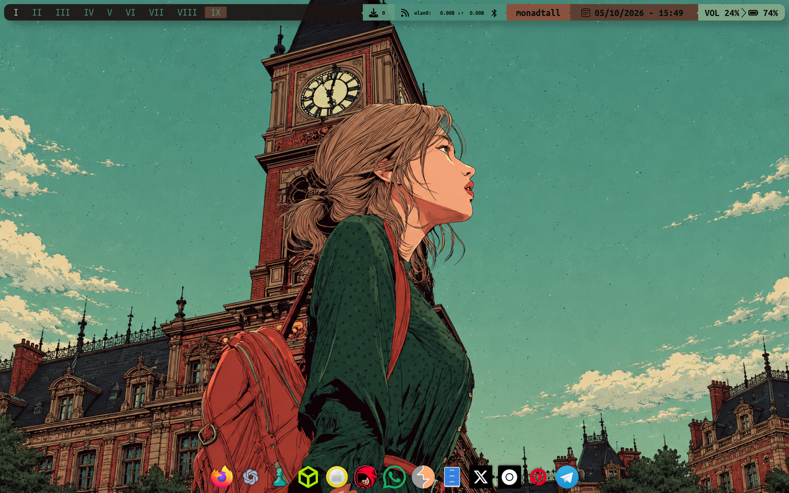</a> |

Click any thumbnail to open the full 1920×1200 capture.

</details>

## Features

- Nine Qtile groups with matching wallpaper and live bar palette
- Modular keys, groups, layouts, screens, widgets and hooks
- Decorated Qtile Extras bar with updates, network, Bluetooth, layout, clock,
  volume and battery status
- Feh wallpaper changes and Pillow-based colour extraction
- Picom Dual Kawase blur, shadows, rounded corners and selectable animations
- Rofi app launcher plus custom Wi-Fi and Bluetooth menus
- Transparent Kitty setup and intelligent-hiding Plank dock
- Custom Fish prompt, Fastfetch greeting, Btop and Cava terminal styling
- Qtile/Plank focus integration and hover-aware layout margins
- Touchscreen/manual autorotation helpers for X11
- Desktop widgets automatically hidden when a workspace has application windows

## Components

| Component | Software |
|---|---|
| Distribution | Arch Linux |
| Window manager | Qtile 0.37.1 |
| Display server | X11 |
| Compositor | Picom 13 |
| Launcher | Rofi 2.0.0 |
| Terminal | Kitty 0.49.2 |
| Dock | Plank Reloaded 0.11.172 |
| Wallpaper | Feh 3.13.1 |
| Screenshots | Scrot 2.0.0 |
| Notifications | Dunst / libnotify |
| Desktop widgets | Custom GTK 3 MacWidgets |
| Terminal tools | Fish, Fastfetch, Htop, Ranger, Btop, Cava |

## Installation

Inspect before applying anything:

```bash
./install/install.sh --dry-run
```

The real mode shows targets, asks once for confirmation and backs up every
existing destination before copying. It does not install packages, touch
LightDM or import Plank settings automatically.

```bash
sed '/^#/d;/^$/d' packages/pacman.txt | sudo pacman -S --needed -
python -m pip install --user 'qtile-extras==0.35.0'
./install/install.sh
```

Read the [installation guide](docs/installation.md) and add licensed wallpaper
files before restarting Qtile.

## Dependencies

Official packages are in [`packages/pacman.txt`](packages/pacman.txt), foreign
packages in [`packages/aur.txt`](packages/aur.txt), and feature-specific helpers
in [`packages/optional.txt`](packages/optional.txt). See the
[dependency notes](docs/dependencies.md) for why each group exists.

## Keybindings

- `Mod+1`…`Mod+9`: switch workspace
- `Mod+Shift+1`…`Mod+Shift+9`: move focused window
- `Mod+Return`: Kitty
- `Mod+d`: Rofi application launcher
- `Mod+j/k/h/l`: move focus
- `Mod+Tab`: next layout
- `Mod+s`: screenshot

The complete extracted list is in [docs/keybindings.md](docs/keybindings.md).

## Project structure

```text
config/     active desktop and terminal-tool configuration snapshots
scripts/    wallpaper, Plank, Qtile and utility scripts
themes/     externally referenced Rofi theme
assets/     sanitized screenshots; wallpaper licensing note
docs/       architecture and operational reference
packages/   official, AUR/user-local and optional dependencies
install/    cautious, backup-first installer
```

## Documentation

- [Architecture](docs/architecture.md)
- [System and security audit](docs/audit.md)
- [Configuration inventory](docs/configuration.md)
- [Workspaces](docs/workspaces.md)
- [Widgets](docs/widgets.md)
- [Scripts](docs/scripts.md)
- [Themes and colours](docs/themes.md)
- [Troubleshooting](docs/troubleshooting.md)
- [Third-party material](docs/third-party.md)

## Notes and licensing

Hardware names (`wlan0`), a Fish `volume` function, 1920×1200 geometry and the
Plank detector's 1920×140 match are machine-specific. Absolute home paths in the
snapshot document the audited machine; the installer ports them in installed
copies.

The MIT license covers original code and configuration in this repository. It
does not claim ownership of third-party themes, fonts, icons or wallpapers.
Original wallpapers are not redistributed because their licensing could not be
verified. The squared Nord Rofi file retains its author attribution.
