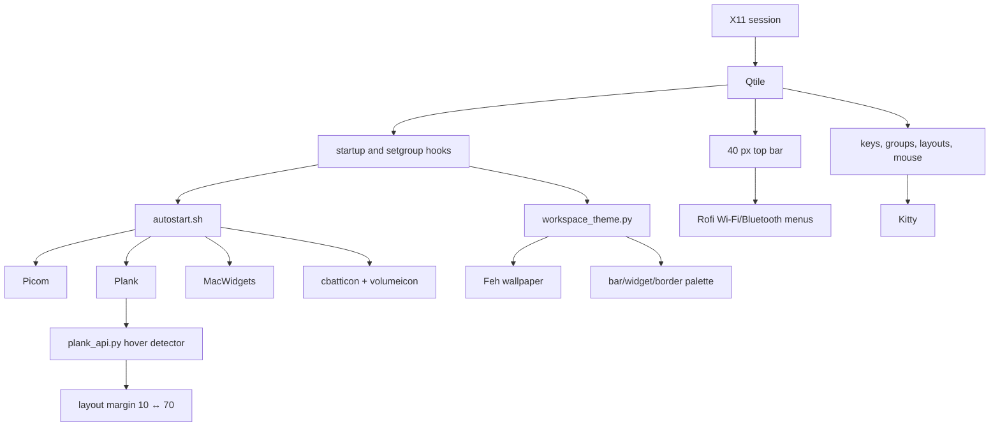

# Architecture

The active session is Arch Linux with Qtile 0.37.1 on X11. `config.py` imports
small modules from `settings/`; it does not contain a second hidden config.

At `startup_once`, Qtile runs `autostart.sh` and starts the Plank detector.
At `startup_complete` and on every `setgroup`, `workspace_theme.py` loads
`workspace-themes.json`, asks Feh to fill the root window and recolours every
registered widget plus layout borders. A delayed double application works
around asynchronous widgets such as Battery.

`widget_visibility.py` hides MacWidgets when an application exists in the
current group and shows them on an empty group. Plank is set to the current
workspace, intelligent hiding, 56 px icons and 115% zoom. Its detector watches
Enter/Leave events on the 1920×140 dock window and changes layout margins.

The configuration is single-monitor aware but counts connected outputs with
`xrandr`; additional screens receive a reduced bar.
